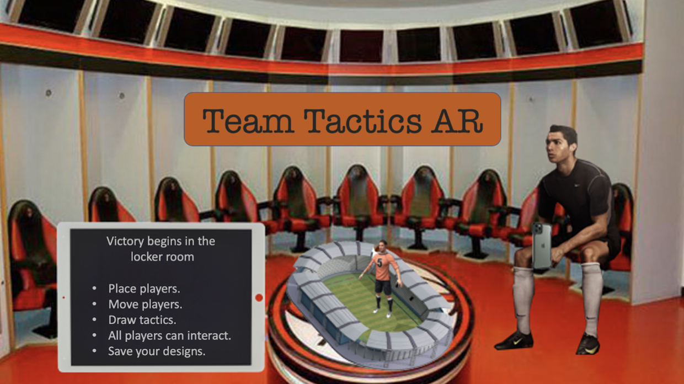

# Team-Tactics-AR

  

## Concept
In team sports, before each game the players meet with their coach to discuss the positions and tactics for the game. Now with Team Tactics AR, players don't just have to plan on a board or a sheet of paper that only the coach has full visualization on. Our application allows the coach to create position templates, tactics and show them to all players, who can access the same virtual 3D whiteboard from their own smartphone.

## Proof of Concept
As proof of concept, an AR application will be designed with the ability to put a 3D model of a soccer field on a QR code. Then, the user will be able to put players inside the virtual stadium to create positions and draw tactics with their smartphone.

## Features
- Image tracking of the soccer field.
- Place players with different animations.
- Select the players team.
- Move players.
- Rotate players.

## Future
The app will be developed with AR Foundation Unity tools in a way it can be built in either: iOS and Android devices. The specific tools are listed to complete the features for this app:
- Place 3D objects in QR code with AR: https://www.youtube.com/watch?v=o_z_Eb8Yh2g
- Place 3D objects on a plane: https://www.youtube.com/watch?v=xguiSueY1Lw
- Draw in AR: https://www.youtube.com/watch?v=ZvIgKOAZ1xc

